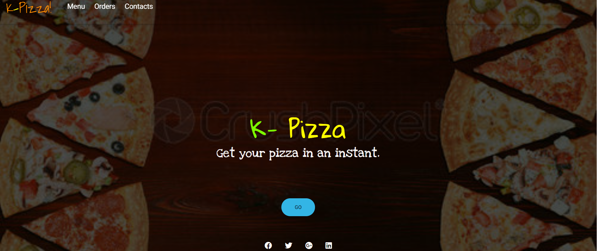

# Pizza App
Display k-Pizza

 

## Getting Started

A web application that you can choose type of pizza and order it online.

## Author
 Eugene Kiprotich.

### Projects Purpose
To make your life more easier whe ou want to order a pizza while your at home.

## Demo
Here is a working live demo: 

Installation instructions
Open a browser, copy and paste the live demo link.It will open the landing page of the app.Make your order.

## Mobile support
The K-Pizza app is compatible with devices of all sizes and all OS's and consistent improvements are being made.

## Built With
HTML - for front end development
CSS - styling the user interface.
Javascript - For the business logic.
Bootstrap - for styling of the user interface.

## contact information
eugenekiprotich0@gmail.com

### License and copyright
Eugene, kiprotich Licensed under the MIT License.
